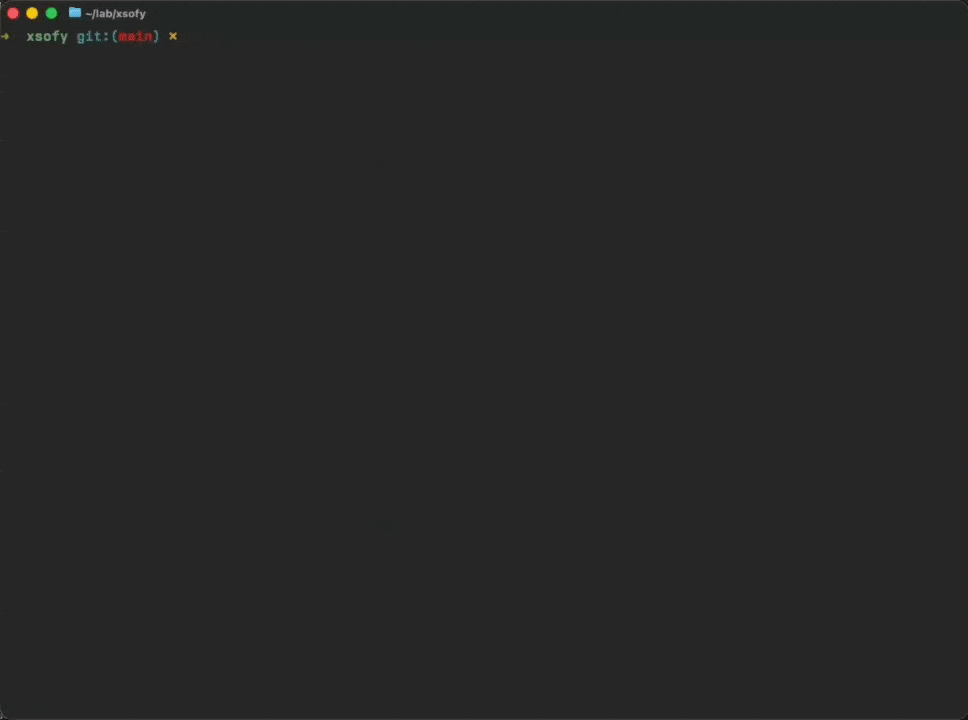

# Xs of Y

A roguelike where the magic system is lisp. Work in progress.



Runes are secretly s-expressions, randomized each run. The player has root access to the game's physics engine but the documentation is in a dead language that changes every boot.

Think Brogue meets Noita, written in ~3800 lines of [let-go](https://github.com/nooga/let-go) — a Clojure dialect running on a Go bytecode VM. No dependencies. Starts in 6ms.

## What works

Dungeon crawling with rooms, corridors, doors, FOV, torches that cast light, grass that burns, blood that splatters proportional to how hard you hit, creatures that snore behind walls, and a rune spell system where `[:fire]` on a dagger means something very different than `[:fire]` on a scroll.

Equip a thunder hammer and watch lightning arc between enemies. Pick up a vampiric blade and heal with every cut. Set a goblin on fire near some grass and enjoy the chain reaction.

## What doesn't work yet

The rune identification system (the core mystery mechanic), gas simulation, time travel spells, machine rooms, and probably several things that crash when you look at them funny.

## Running

```bash
lg main.lg
```

Get `lg` from [let-go](https://github.com/nooga/let-go).

## Design

- [`design.md`](design.md) — the concept
- [`spell-dsl.md`](spell-dsl.md) — how rune spells compose
- [`world-systems.md`](world-systems.md) — everything else
