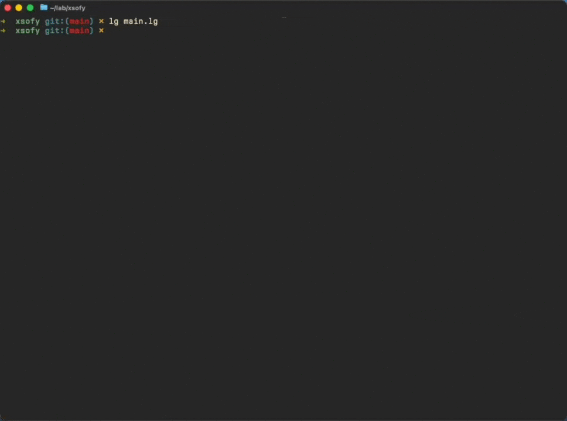

# Xs of Y

A roguelike where the magic system is lisp.

**[Play in your browser](https://nooga.github.io/xsofy/)**



Every run generates a new title (*Gazebos of Mounting Dread*), a new quest (*retrieve the Spatula of Futility*), and a new set of rune mappings. The runes are secretly s-expressions. You have root access to the dungeon's physics engine but the man pages are in a dead language that changes every boot.

You find a sword. It has runes on it. You don't know what the runes mean. You hit a goblin with it and the goblin catches fire. Great. You find another sword with different runes. You hit a goblin and *you* catch fire. `(self fire)` — you should have read the documentation. There is no documentation. That's the point.

Each floor has runestones that teach you one rune meaning when you touch them. Over time you decode the spell system and graduate from "terrified of your own equipment" to "basically a god who occasionally explodes." The power curve is inverted — early game is desperate survival, late game is applied theology with inadequate safety margins.

Meanwhile the dungeon is trying to kill you through more conventional means. Spiders shoot web cones that trap you while goblins close in. Slimes split when you hit them. Trolls regenerate. Set something on fire and it panics, runs through grass, ignites the grass, ignites more creatures — it's fine, everything is fine. Push an ogre into lava. Push a goblin into another goblin. Push yourself into a chasm by accident. Chasms are educational.

Written in ~6900 lines of [let-go](https://github.com/nooga/let-go) — a Clojure dialect on a Go bytecode VM. Persistent data structures all the way down. No dependencies. 6ms startup. Runs natively or [in the browser](https://nooga.github.io/xsofy/) via WASM.

## Running

```bash
lg main.lg
```

Get `lg` from [let-go](https://github.com/nooga/let-go), or:

```bash
brew tap nooga/let-go https://github.com/nooga/let-go
brew install let-go
```

## Docs

- [`design.md`](docs/design.md) — the concept
- [`spell-dsl.md`](docs/spell-dsl.md) — how `(apply area 2 fire)` actually works
- [`loot-system.md`](docs/loot-system.md) — depth curves, cursed items, procedural runics
- [`world-systems.md`](docs/world-systems.md) — the rest
